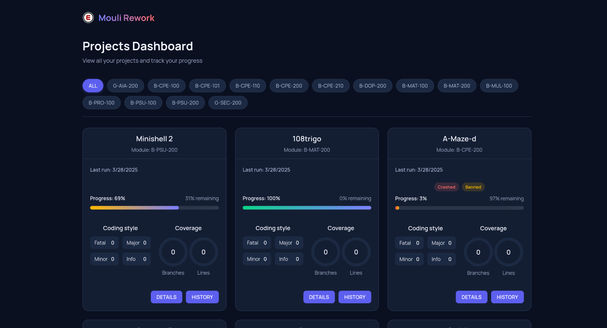

# 🚀 Epitech Addons

  
   
  <h3>Browser extensions and tools to supercharge your Epitech experience</h3>
  
  
  

## 📌 Overview

Epitech Addons is a collection of open-source browser extensions and tools designed by Epitech students for Epitech students. Our mission is to improve productivity, enhance academic performance, and make the Epitech learning experience more efficient and enjoyable.

Visit our website: [https://epitechaddons.com](https://epitechaddons.com)

## 🌟 Extensions

### Enhanced Mouli

  

Supercharge your Moulinette experience with detailed skill tracking, visual progress, and focus recommendations.

**Features:**
- 📊 **Detailed Skill Breakdown** - See your progress on individual skills and tests for each project
- 🎯 **Focus Recommendations** - Get smart suggestions on which skills to focus on to maximize your score
- 📈 **Visual Progress Tracking** - Watch your progress with beautiful, color-coded indicators

**Installation:**
- [Download Enhanced Mouli](https://epitechaddons.com/enhanced_mouli)

**Credits**
- [Original Extension](https://chromewebstore.google.com/detail/my-epitech-percentages/hepfpnmpnjacajnfkpmmmhhbiaggddin?pli=1)

### Mouli Rework

  

A complete redesign of the Moulinette interface with a modern dashboard, detailed test information, and project history tracking.

**Features:**
- 🖥️ **Modern Dashboard** - Clean and intuitive project overview with filtering capabilities
- 📊 **Detailed Test Information** - Comprehensive breakdown of test results with expandable error messages
- 📝 **Coding Style Analysis** - Visual representation of coding style violations by severity
- 📈 **Coverage Metrics** - See branch and line coverage in a visually appealing format
- 🕒 **Project History** - Track your progress over time with full history of test runs

**Installation:**
- [Download Mouli Rework](https://epitechaddons.com/mouli_rework)

## 🔮 Coming Soon

We're working on additional browser extensions and tools to further enhance the Epitech experience. Stay tuned for updates!

## 🤝 Contributing

We welcome contributions from all Epitech students! Whether you want to fix a bug, add a feature, or improve documentation, your help is appreciated.

1. Fork the repository
2. Create your feature branch (`git checkout -b feature/amazing-feature`)
3. Commit your changes (`git commit -m 'Add some amazing feature'`)
4. Push to the branch (`git push origin feature/amazing-feature`)
5. Open a Pull Request

## 📜 License

This project is licensed under a NO DISTRIBUTION license - see the [LICENSE](LICENSE) file for details.

## 📢 Acknowledgements

- Thanks to all Epitech students who contributed to this project

---

  
Made with ❤️ by Epitech Students

  

    <a href="https://github.com/epitech-addons">GitHub</a> •
    <a href="https://epitechaddons.com">Website</a>
  

